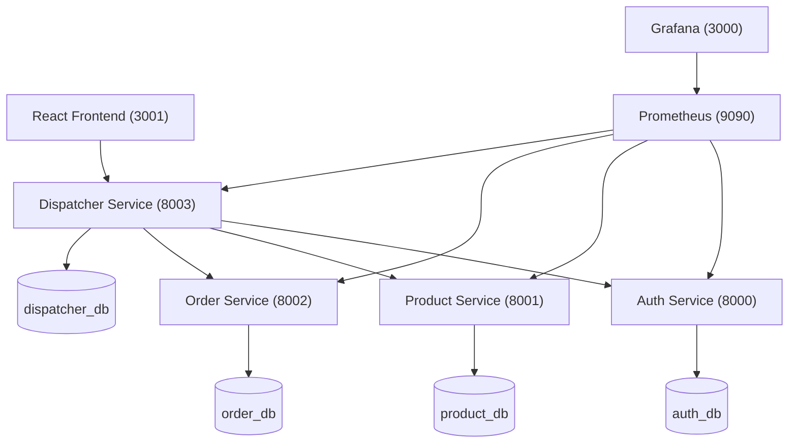
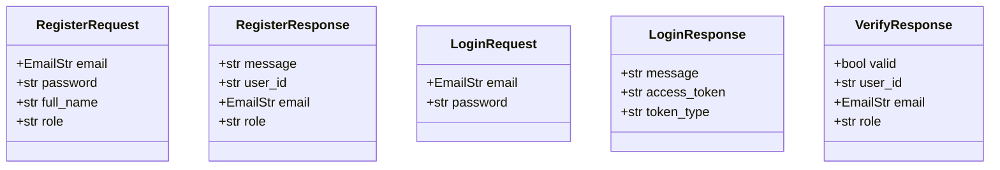
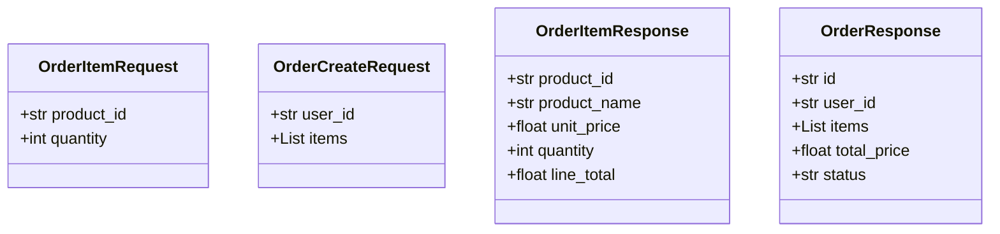
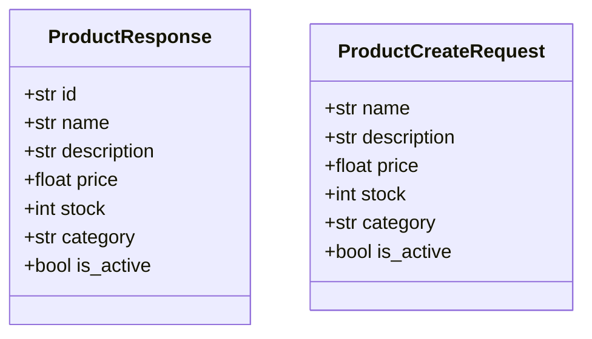
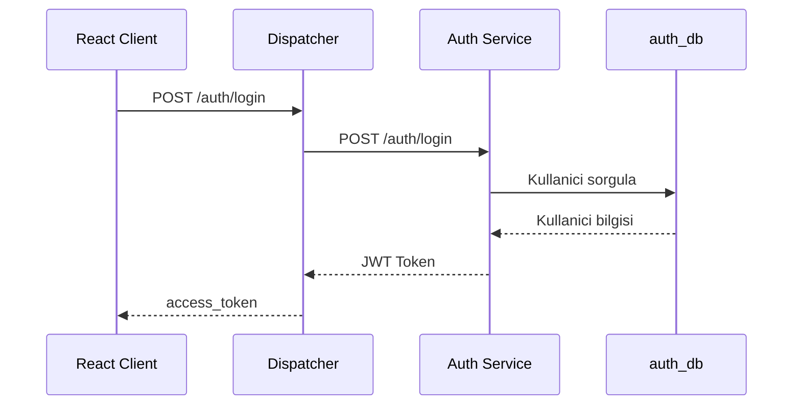
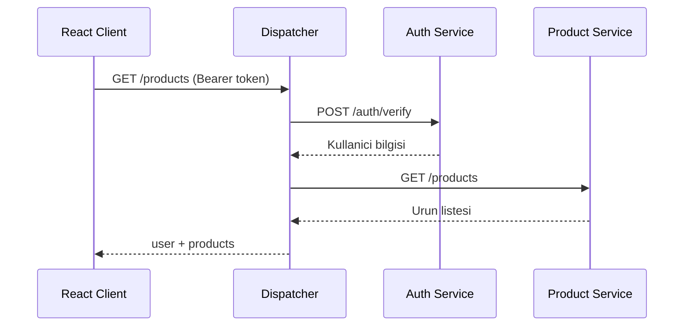
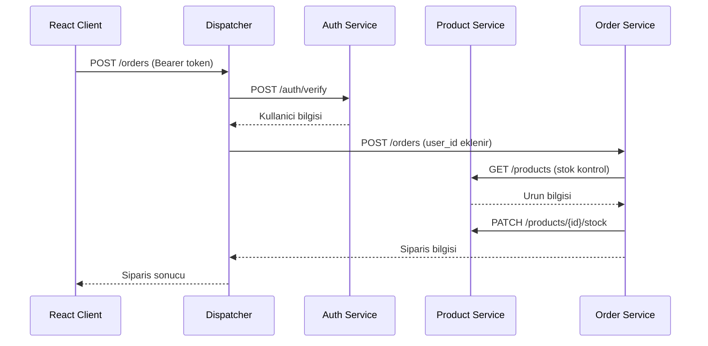
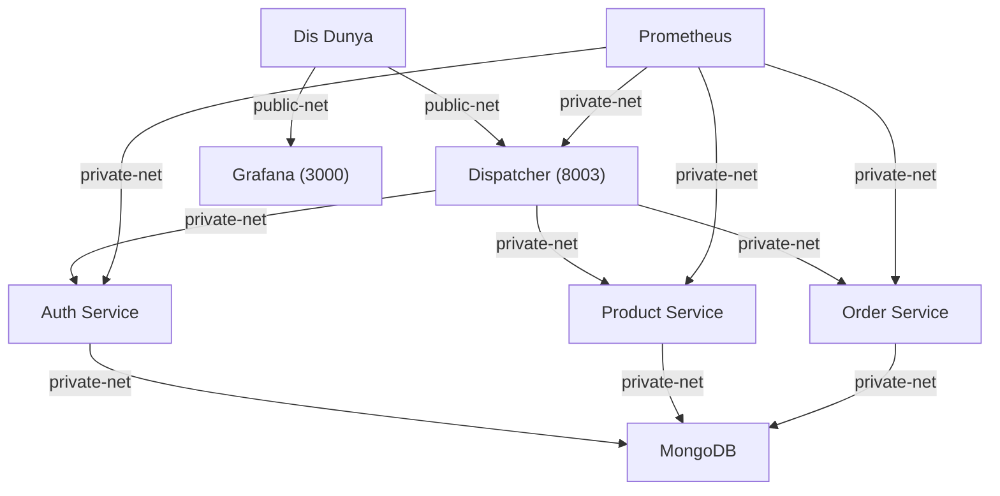

# Mikroservis Mimarisi ile API Gateway Uygulamasi

**Ders:** Yazilim Gelistirme Laboratuvari-II  
**Universite:** Kocaeli Universitesi, Teknoloji Fakultesi, Bilisim Sistemleri Muhendisligi  
**Takim Uyeleri:** Gizemnur Arslan (231307024), Umut Sahin (231307091)  
**Tarih:** 5 Nisan 2026

---

## 1. Giris

### Problemin Tanimi

Modern yazilim sistemlerinde monolitik mimariler, olceklenebilirlik, bagimsiz deploy edilebilirlik ve hata izolasyonu konularinda ciddi kisitlamalar ortaya koymaktadir. Bu proje, bu sorunlara cozum olarak mikroservis mimarisini benimsemekte ve tum dis istekleri merkezi bir Dispatcher (API Gateway) uzerinden yoneten, guvenli ve olceklenebilir bir uygulama sunmaktadir.

### Amac

Bu projenin temel amaci; bagimsiz calisabilen mikroservisler gelistirmek, bu servisleri tek bir giris noktasindan yoneten bir Dispatcher tasarlamak, TDD (Test-Driven Development) disipliniyle kod kalitesini artirmak ve Docker ile tum mimarinin tek komutla ayaga kalkmasini saglamaktir.

---

## 2. Sistem Tasarimi

### Richardson Olgunluk Modeli (RMM)

Richardson Olgunluk Modeli, REST API'lerin ne kadar olgun oldugunu olcen bir modeldir. Bu projede **Seviye 2** uygulanmistir.

- **Seviye 0:** Tek URL, tek metot
- **Seviye 1:** Kaynaklar URI uzerinden tanimlanir
- **Seviye 2 (Bu Proje):** HTTP metotlari dogru kullanilir (GET, POST, PUT, DELETE) ve dogru HTTP durum kodlari dondurulur
- **Seviye 3:** HATEOAS (Hypertext as the Engine of Application State)

Bu projede tum kaynaklar URI uzerinden tanimlanmis, islemler uygun HTTP metotlari ile gerceklestirilmis ve hatali durumlarda 401, 403, 404, 500 gibi dogru HTTP durum kodlari kullanilmistir.

### Mikroservis Mimarisi


### Sinif Yapilari

#### Auth Service


#### Order Service


#### Product Service


### Sequence Diyagramlari

#### Login Akisi


#### Urun Listeleme Akisi


#### Siparis Olusturma Akisi


---

## 3. Proje Yapisi ve Moduller

```
WebApplication1/
├── docker-compose.yml
├── prometheus.yml
├── locustfile.py
├── auth-service/
│   ├── Dockerfile
│   ├── requirements.txt
│   ├── main.py
│   ├── routes.py
│   ├── models.py
│   └── database.py
├── product-service/
│   ├── Dockerfile
│   ├── requirements.txt
│   ├── main.py
│   ├── routes.py
│   ├── models.py
│   └── database.py
├── order-service/
│   ├── Dockerfile
│   ├── requirements.txt
│   ├── main.py
│   ├── routes.py
│   ├── models.py
│   └── database.py
├── dispatcher/
│   ├── Dockerfile
│   ├── requirements.txt
│   ├── main.py
│   ├── database.py
│   ├── auth_client.py
│   ├── product_client.py
│   ├── order_client.py
│   └── test_dispatcher.py
└── frontend/
    └── src/
        └── components/
            ├── Login.js
            ├── Register.js
            ├── Dashboard.js
            ├── Products.js
            ├── Orders.js
            ├── CreateOrder.js
            ├── AddProduct.js
            ├── Logs.js
            └── Monitoring.js
```

### Servisler

| Servis | Port | Veritabani | Aciklama |
|---|---|---|---|
| Auth Service | 8000 | auth_db | Kullanici kayit, giris, token dogrulama |
| Product Service | 8001 | product_db | Urun listeleme, ekleme, stok guncelleme |
| Order Service | 8002 | order_db | Siparis olusturma ve listeleme |
| Dispatcher | 8003 | dispatcher_db | API Gateway, yetkilendirme, log tutma |
| MongoDB | 27017 | - | NoSQL veritabani |
| Prometheus | 9090 | - | Metrik toplama |
| Grafana | 3000 | - | Trafik gorsellestirme |

### Network Izolasyonu

Projede iki ayri Docker networku tanimlanmistir. Sadece Dispatcher ve Grafana dis dunyaya acikken diger tum servisler yalnizca ic agda calismaktadir.



---

## 4. Kurulum ve Calistirma

### Gereksinimler
- Docker Desktop
- Node.js

### Calistirma

```bash
# Servisleri baslat
docker compose up --build

# React arayuzunu baslat (ayri terminalde)
cd frontend
npm start

# Yuk testi (ayri terminalde)
locust -f locustfile.py
```

---

## 5. Uygulama Ekran Goruntuleri ve Test Sonuclari

### React Arayuzu

**Urunler Sayfasi** — Admin rolüyle giris yapildiktan sonra urun listesi goruntulenmektedir.


**Urun Ekle Sayfasi** — Yalnizca admin rolundeki kullanicilar urun ekleyebilmektedir.

.jpeg)

**Trafik Loglari** — Dispatcher uzerinden gecen tum istekler zaman, method, path, kullanici ve HTTP status bilgileriyle loglanmaktadir.


### API Dokumantasyonu

**Dispatcher Swagger UI** — Dispatcher servisi 8003 portundan dis dunyaya aciktir ve FastAPI otomatik dokumantasyonu sunmaktadir.


**Auth Service (Erisim Engellendi)** — Auth servisi yalnizca ic agda (private-net) calistigindan dogrudan erisim mumkun degildir. Bu, network izolasyonunun calismakta oldugunu kanitlamaktadir.


### Grafana Izleme

**HTTP Requests Total** — Prometheus metrikleri Grafana uzerinden gercek zamanli olarak izlenmektedir. Yuk testi sirasinda tum servislerin trafigi gorsellestirilmistir.


### TDD - Dispatcher Testleri

Dispatcher servisi TDD (Red-Green-Refactor) yaklasimi ile gelistirilmistir. Test dosyasinin zaman damgasi fonksiyonel koddan oncedir.

```bash
cd dispatcher
pytest test_dispatcher.py
```

### Yuk Testi Sonuclari

Locust ile farkli kullanici seviyelerinde yuk testi gerceklestirilmistir. Tum testlerde hata orani **%0** olarak gerceklesmistir.

**10 Kullanici — RPS: 4.88**


**50 Kullanici — RPS: 18.5**


**100 Kullanici — RPS: 26.1**

.jpeg)

**200 Kullanici — RPS: 93.7**


**500 Kullanici — RPS: 51.4**


#### Yuk Testi Ozet Tablosu

| Kullanici | RPS | Hata Orani | Ort. Yanis Suresi |
|---|---|---|---|
| 10 | 4.88 | %0 | 120 ms |
| 50 | 18.5 | %0 | 129 ms |
| 100 | 26.1 | %0 | 644 ms |
| 200 | 93.7 | %0 | 173 ms |
| 500 | 51.4 | %0 | 682 ms |

#### Yorum

10 ve 50 kullanici seviyesinde sistem stabil calismis, yanis sureleri dusuk kalmistir. 100 kullanicida RPS artmaya devam etmis ancak yanis suresi 644ms'ye yukselmeye baslamistir. Tum testlerde hata orani %0 olarak gerceklesmistir.

---

## 6. Sonuc ve Tartisma

### Basarilar

- Mikroservis mimarisi basariyla gerceklendi, her servis bagimsiz olarak calisabilmektedir.
- Dispatcher uzerinden merkezi yetkilendirme saglanmis, ic servisler dis dunyaya kapali tutulmustur.
- TDD yaklasimi ile dispatcher servisi gelistirilmis, tum testler basariyla gecmektedir.
- Docker Compose ile tum mimari tek komutla ayaga kalkmaktadir.
- Prometheus ve Grafana ile gercek zamanli trafik izleme saglanmistir.
- Admin/kullanici rol ayrimli React arayuzu gelistirilmistir.

### Sinirliliklar

- Stok guncelleme islemleri atomik degildir, cok yuksek es zamanli isteklerde tutarsizlik olusabilir.
- Servisler arasi iletisimde retry mekanizmasi bulunmamaktadir.
- JWT token suresi doldugundan otomatik yenileme (refresh token) yoktur.

### Olasi Gelistirmeler

- Redis ile token blacklist ve cache mekanizmasi eklenebilir.
- Servisler arasi iletisimde message queue (RabbitMQ/Kafka) kullanilabilir.
- Kubernetes ile orkestrasyon saglanabilir.
- HTTPS ve SSL sertifikasi eklenebilir.

---

## Teknolojiler

- **FastAPI** - Python web framework
- **MongoDB** - NoSQL veritabani
- **Docker & Docker Compose** - Konteynerizasyon
- **Prometheus** - Metrik toplama
- **Grafana** - Gorsellestirme
- **Locust** - Yuk testi
- **React** - Frontend arayuzu
- **JWT** - Kimlik dogrulama
- **Pytest** - TDD test framework
